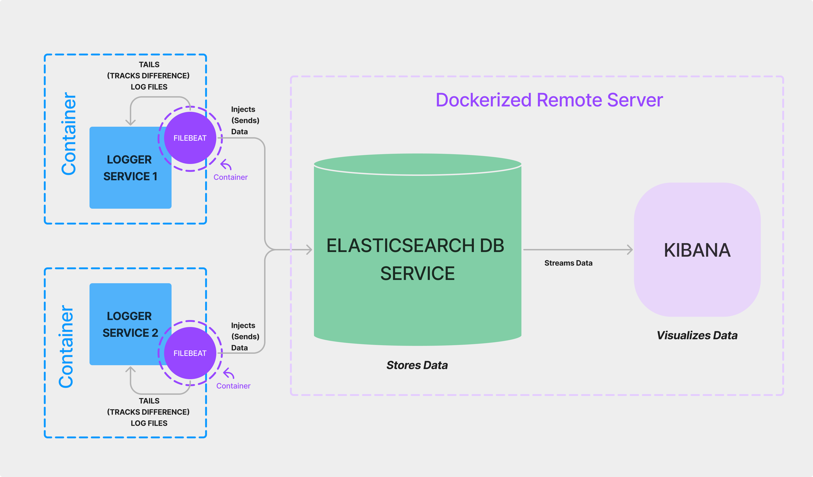

# Elastic Stack Observability Setup

This repository contains the files needed to setup the Elastic Stack for Observability.

## Prerequisites

- Docker
- Docker Compose
- Make
- Git

### Easticsearch

Elasticsearch is the heart of the Elastic Stack. It stores your data in a distributed, JSON-based search and analytics engine designed for horizontal scalability, maximum reliability, and easy management.

### Kibana

Kibana is a  user interface that lets you visualize your Elasticsearch data and navigate the Elastic Stack. Do anything from tracking query load to understanding the way requests flow through your apps.

### Beats

Beats are lightweight data shippers that you install as agents on your servers to send specific types of operational data to Elasticsearch. Beats have a small footprint and use fewer system resources than Logstash.

#### Filebeat

Filebeat is a lightweight shipper for forwarding and centralizing log data. Installed as an agent on your servers, Filebeat monitors the log files or locations that you specify, collects log events, and forwards them either to Elasticsearch or Logstash for indexing.

#### Metricbeat

Metricbeat is a lightweight shipper that you can install on your servers to periodically collect metrics from the operating system and from services running on the server. Metricbeat takes the metrics and statistics that it collects and ships them to the output that you specify, such as Elasticsearch or Logstash.

## How it works

### Architecture



### Flows

1. Different services creates the logs.
2. Filebeat tails and sends the logs to Elasticsearch (logstash is skipped since it is quite heavy).
3. Elasticsearch stores the logs.
4. Kibana visualizes the logs.

## Compose files

### 1. docker-compose.yml

It consists of the implementaion of the Elastic Stack **by using ssl** certificate and keys.
So, it is secure and uses https encryptions.

### 2. no-ssl.docker-compose.yml

It consists of the implementaion of the Elastic Stack **without using ssl** certificate and keys. So, it is not as secure and does not use https encryptions.

## Setup

> *Note:*  
> *The steps are done from the root directory of the repository.*  
> *The commands are for Linux. Make sure to have Make and Docker installed*

### 1. Clone the repository

```bash
git clone ...
```

### 2. Start Main Elastic Stack

#### Start the stack

```bash
make dev-no-ssl
```

#### Stop the stack

```bash
make stop-no-ssl
```

### 3. Start Mock Filebeat Service

In the *mock-filebeat* directory, it consists of a mock third party service that generates logs and sends them to the Elastic Stack using filebeat.

#### Start the service

```bash
make dev-mock
```

#### Stop the service

```bash
make stop-mock
```

### 4. Open Kibana

Open the browser and go to [http://localhost:5601](http://localhost:5601)

You will be prompted to login. Use the following credentials:

- Username: elastic
- Password: <described in the .env file>

### 5. See visualizations

> Note: A bit of setup is required to see visualizations of the log data, which will be coverd later

#### TODO: Add steps and screenshots
